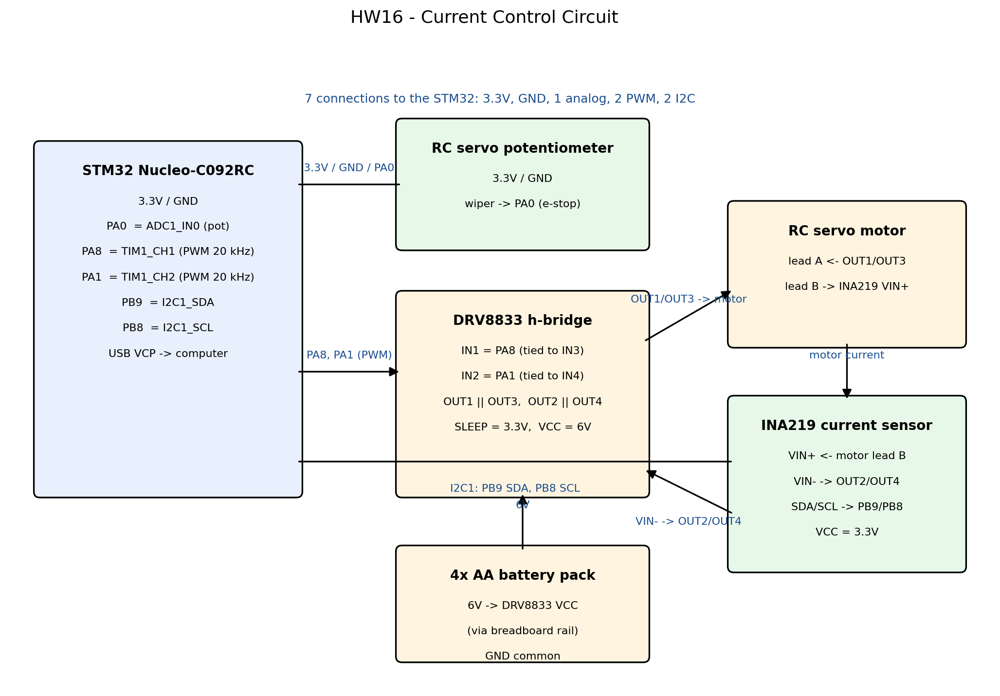
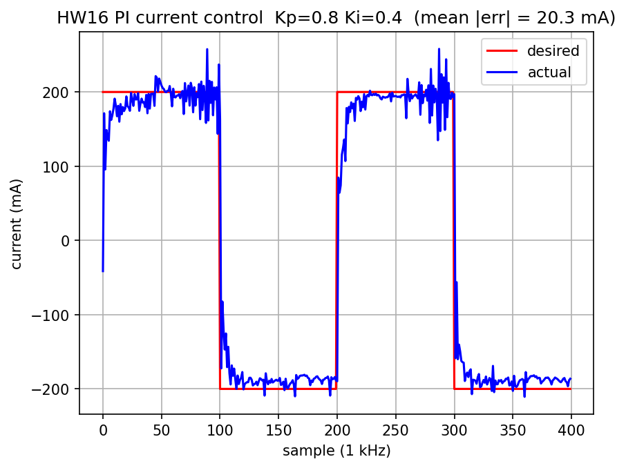

# HW16 - Current Control with the STM32

PI current control of the RC servo motor on the Nucleo-C092RC, using the
DRV8833 h-bridge and the INA219 current sensor. This is the inner current
loop that the [HW18](../HW18) haptic paddle runs at 1 kHz.

## Circuit

Generated by [circuit_diagram.py](circuit_diagram.py):



7 connections to the STM32: 3.3V, GND, 1 analog pin, 2 PWM pins, 2 I2C pins.

| STM32 pin | Goes to |
|-----------|---------|
| 3.3V      | pot power, INA219 VCC, DRV8833 SLEEP |
| GND       | pot, INA219, DRV8833, battery pack GND |
| PA0 (ADC1_IN0) | RC servo potentiometer wiper |
| PA8 (TIM1_CH1) | DRV8833 IN1 (and IN3, bridges in parallel) |
| PA1 (TIM1_CH2) | DRV8833 IN2 (and IN4) |
| PB9 (I2C1_SDA) | INA219 SDA |
| PB8 (I2C1_SCL) | INA219 SCL |

Motor current path: DRV8833 OUT1/OUT3 → motor → INA219 VIN+ … VIN- → DRV8833
OUT2/OUT4. DRV8833 VCC gets 6V from the 4xAA pack (route through the
breadboard, not directly onto the pin, to avoid shorts when plugging in).

## CubeMX setup

Start from the FDCAN_Com_Polling example (same base as HW12 — the CAN code is
unused now but HW18 will use it to receive the desired current from the Pico):

- **Bsp**: enable "Human Machine Interface" (user button, LEDs, Virtual Com Port)
- **Analog**: ADC1 IN0 on PA0
- **Timers / TIM1**: PWM Generation CH1 (PA8) and CH2 (PA1), Counter Period
  2400 → 20 kHz PWM with 2400-count resolution
- **Timers / TIM2**: Internal Clock, Counter Period 48000 → 1 kHz; enable the
  TIM2 global interrupt in NVIC Settings
- **Connectivity**: I2C1 (PB9 = SDA, PB8 = SCL — the wiki uses I2C2 on
  PA6/PA7, but any I2C instance works; this circuit uses the Arduino-header
  I2C pins D14/D15)

The full STM32CubeIDE project is in
[FDCAN_Com_Polling/](FDCAN_Com_Polling/); the HW16 code lives in the USER
CODE sections of [Src/main.c](FDCAN_Com_Polling/Src/main.c).

## How it works

- `readPot()` polls ADC1; the pot reading is an emergency end stop — if it
  leaves [250, 3845] the interrupt forces both PWM compares to 2400 (both
  h-bridge inputs high = motor off) and aborts the run.
- The INA219 is configured for 10-bit, ±160 mV, 148 µs/sample
  (config `0b0011000010001111`, calibration 1024); the CURRENT register
  (0x04) then reads back signed current in units of 1/3 mA.
- The 1 kHz TIM2 interrupt runs the PI controller while `state == 1`:
  square-wave reference ±200 mA flipping every 100 samples, 400 samples
  total, then motor off and `state = 0`. Desired and actual currents are
  saved into arrays during the run.
- The main loop waits for `'a'` on the virtual COM port, sets `state = 1`,
  blocks until the run finishes, then prints `index desired actual` (raw
  1/3-mA units) for all 400 samples.
- At boot the code writes the INA219 config and reads it back; if the sensor
  doesn't answer, runs are refused with a warning instead of hanging (HAL
  timeouts don't work inside the interrupt because the tick freezes there).
  The boot banner also prints the current pot and current readings as a
  quick wiring check.
- Drive convention (slow decay): one input held at 100% while the other is
  modulated; a *smaller* compare value = larger effective duty = faster.
  Both inputs are never low at the same time.

## Tuning

```
python plot_current.py /dev/tty.usbmodemXXXX --kp 0.8 --ki 0.4
```

The script sends `'a'`, collects the 400 samples, and plots desired vs.
actual current in mA (with the mean |error| in the title). `Kp`/`Ki` are
hard-coded in main.c — edit, rebuild, flash, re-run until the actual current
tracks the ±200 mA square wave with fast rise and no steady-state error
(raise Kp until it responds quickly, then raise Ki to kill the offset; back
off if it oscillates).

Tuning progression on the real hardware (1 kHz loop, 4xAA pack):

| Kp | Ki | mean abs error | behavior |
|----|----|---------------|----------|
| 0.5 | 0.05 | 89.0 mA | stable but sluggish, large offset |
| 2.0 | 0.2 | 163.9 mA | limit-cycle oscillation, ±700 mA bursts |
| 1.0 | 0.1 | 53.7 mA | stable, ~40 mA steady-state offset |
| 1.0 | 0.3 | 25.9 mA | fast, oscillation onset near +200 mA |
| **0.8** | **0.4** | **20.3 mA** | **final: fast rise, no instability** |

Final response: 

## Deliverables

- [x] Circuit diagram (`circuit_diagram.png`)
- [x] STM32 code (`FDCAN_Com_Polling/Src/main.c`)
- [x] Python collection/plotting script (`plot_current.py`)
- [x] Tuned controller response (`tune_kp0.8_ki0.4.png`, Kp=0.8 Ki=0.4,
  mean |err| = 20.3 mA over the 400-sample run)
