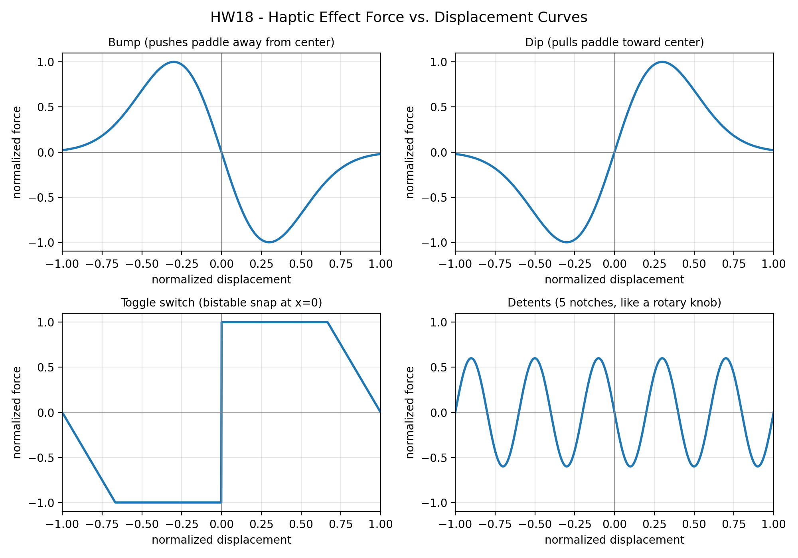
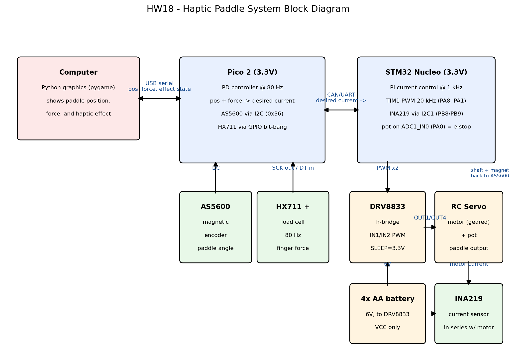

# HW18 - Haptic Paddle: Putting It All Together

## 1. Haptic effect force vs. displacement curves

Generated by [haptic_effects.py](haptic_effects.py), normalized to ±1:

- **Bump**: a potential hill — the force pushes the paddle away from the center
  as you climb in (force is the negative slope of a gaussian hill).
- **Dip**: the opposite — the paddle is pulled toward the center and has to be
  pushed out.
- **Toggle switch**: bistable spring; it resists until the paddle crosses
  center, then snaps over to the other side.
- **Detents**: periodic spring force toward the nearest notch, like the clicks
  of a rotary knob.

## 2. Mechanical parts

CAD and 3D-printed parts are in the [HW15](../HW15) folder: an arm that clamps
to the servo horn and the load cell outer rim, a thimble on the load cell
center for the fingers, and a mount holding the AS5600 magnet coaxial with the
motor spline within 1 mm of the sensor.

## 3. System block diagram

Generated by [block_diagram.py](block_diagram.py):

Signal flow:

1. The **Pico 2** reads paddle angle from the **AS5600** (I2C, addr 0x36) and
   finger force from the **HX711 + load cell** (bit-banged GPIO, 80 Hz).
2. A **PD controller at 80 Hz** on the Pico converts position + force into a
   desired current using the haptic effect equations above.
3. The desired current is sent to the **STM32 Nucleo** (CAN/UART), which runs a
   **PI current controller at 1 kHz**: it reads actual motor current from the
   **INA219** (I2C1, PB8/PB9) and sets the two **TIM1 PWM** outputs (PA8/PA1,
   20 kHz) driving the **DRV8833 h-bridge** (powered by 4×AA = 6V, SLEEP tied
   to 3.3V, both bridges in parallel).
4. The servo potentiometer on **ADC1_IN0 (PA0)** is an emergency end stop —
   PWM is killed if the reading goes outside the safe range.
5. The Pico streams position/force/effect state back to the computer over USB,
   where a Python graphics window shows the virtual world.

Alternative considered: skip the load cell and use the INA219 current as a
force proxy (current ∝ torque), which lets the PD loop run faster than 80 Hz
at the cost of sensitivity to small forces.
